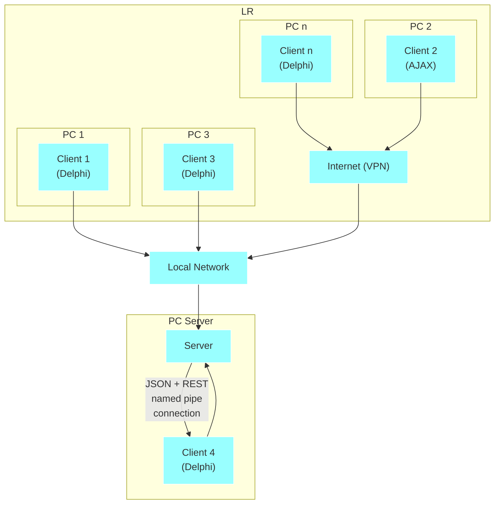
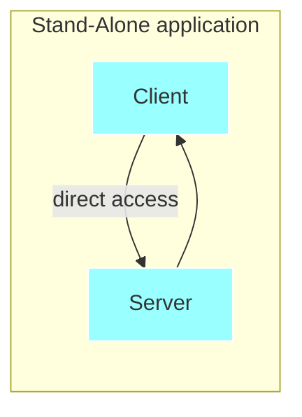

[TOC]

<div STYLE="page-break-after: always;"></div>

# 1. Synopse mORMot概述


&emsp;&emsp;Synopse mORMot是一个开源的客户端-服务端ORM SOA MVC框架，支持Delphi 6到Delphi 10.2 Tokyo和FPC，支持构建Win/Linux服务端应用，支持构建各种跨平台的客户端应用（包括移动端和AJAX）。

&emsp;&emsp;mORMot的主要特征包括：

- ORM/ODM：支持几乎所有数据库（SQL或NoSQL）的对象持久性;
- SOA：将业务逻辑整合到REST服务中；
- 客户端：通过ORM类或SOA接口跨平台访问数据或服务；
- Web MVC：发布ORM/SOA服务以响应Web应用。

&emsp;&emsp;客户端-服务端自适应的REST设计，支持本地或远程访问。

```mermaid
graph TB
  A3 -->B3
  A2 -->B2
  A1 -->B1

  B4 -->B10
  B4 -->B9
  B4 -->B8
  B4 -->B7
  B4 -->B6
  
  B5 -->C2
  B5 -->C1
  
  subgraph LR
    subgraph Featuring
      A4["User Management - Security & Rights<br/>Sessions - Replication<br/>Unit Testing - Mocks/Stubs<br/>Logging - Performance<br/>Profiling - http.sys<br/>WebSockets - MultiCore<br/>Templates (MVC) - JSON<br/>JavaScript Engine - Reporting<br/>PDF - UI"]
    end
    subgraph Services
      A3["Method-based Services<br/>Interface-based Services<br/>Asynchronous (Push) Services<br/>Remote (Saas) Services"]
    end
    subgraph NoSQL Databases
      A2["MongoDB<br/>In-Memory<br/>File"]
    end 
    subgraph SQL Databases
      A1["SQLite3 - Firebird - NexusDB<br/>PostgreSQL - MySQL - DB2<br/>MS SQL - Oracle - Informix"]
    end
  end
  subgraph LR
    subgraph REST Clients
      B7[Delphi]
      B8[Mobile]
      B9[AJAX]
      B10[...Any]
    end
    B6[Stand Alone<br/>Application]
    subgraph mORMot<br/>Server
      B3[SOA] -->B4[REST Server]
      B2[ODM] -->B4[REST Server]
      B1[ORM] -->B4[REST Server]
      B4 -->B5[MVC/MVVM<br/>Web Serve]
    end
  end
  subgraph Web Clients
    C2[Desktop]
    C1[Mobile]
  end

  classDef cyan fill:#9ff, stroke:#fff
  class A1,A2,A3,A4,B1,B2,B3,B4,B5,B6,B7,B8,B9,B10,C1,C2 cyan
```

&emsp;&emsp;mORMot提供了构建现代软件项目所需的完整功能，包括先进、集成化的软件组件、设计的完整性和互补性、约定优于配置的解决方案、确保速度和效率的代码实现。

&emsp;&emsp;为存储一些数据，您定义了一个类，之后框架将负责完成所有事情：路由、JSON编码、创建表、生成SQL和有效性验证。

&emsp;&emsp;为创建一个服务，您定义了一个接口和类，你要做的也就这些。框架会负责处理ORM/ODM或SOA方法同时在服务端和客户端的运行，一次编码，随处使用！

&emsp;&emsp;为构建MVC的web站点，用Delphi编写一个控制类，然后用Mustache模版制作HTML视图，并复用前面的ORM/ODM或SOA方法模型即可。

&emsp;&emsp;如果您需要HTTP服务器、代理重定向、主/从复制、发布-订阅、测试、模拟、添加安全性、用户及权限管理、脚本引擎、报表、用户界面、转换为XML格式或发布HTML动态页面，您所需要的工具或特性框架中已经存在了，您只需选择适当的类或方法，就等您来使用了。

&emsp;&emsp;这个文档的目录已经清楚说明：这不是一个普通的软件。

&emsp;&emsp;mORMot框架提供了一套开源的完整丰富的单元，使用Delphi初学者版就足以创建各种多层架构，甚至最复杂的[领域驱动设计]()：

- 表现层特性包括Delphi富客户端的MVC UI生成、i18n和报表，基于Mustache模版的web视图及AJAX富客户端；
- 应用层通过基于接口的服务（如WCF）和客户端-服务端ORM实现了面向服务的架构，遵循REST规范，支持多种通信协议（如HTTP/1.1和HTTPS）上的JSON传输；
- 领域模型层使用普通的Delphi对象处理所有的业务逻辑，包括高级类型管理：动态数组、记录、值对象、专用实体类或聚合、变体存储与动态文档的后期绑定，业务逻辑也可以通过服务端JavaScript来完成；
- 数据持久化基础架构层提供ORM持久化，支持Oracle、MS SQL、OleDB、ODBC、Zeos数据库连接，支持各种基于DB.pas驱动（如NexusDB，DBExpress，FireDAC，AnyDAC，UniDAC…）的连接，强大的SQLite3内核支持直接SQL访问，支持SQLite3、Oracle、Jet/MSAccess、MS SQL、Firebird、DB2、MySQL、PostgreSQL、Informix和NexusDB自动化SQL生成；ORM也支持NoSQL引擎，通过框架原生代码连接到MongoDB，完成ODM持久化；
- 公共基础架构层用于处理数据过滤和验证、安全性、会话、缓存、日志和测试（框架使用测试驱动的方法、stub和mock）。

&emsp;&emsp;***译者注：***

&emsp;&emsp;***Cross-Cutting infrastructure layers，公共基础架构层，很多地方将Cross-Cutting译为横切、交叉等，本质上看是指这些功能模块是用于所有模块组件的公共方法。***

&emsp;&emsp;如果你还不清楚其中的一些概念，别担心，本文将会详细介绍。

&emsp;&emsp;对于mORMot，ORM不仅用于数据库对象的数据持久化（在这一点上与其他ORM实现类似），也是面向服务的多层体系架构（SOA）的一部分，也是领域驱动的解决方案。

&emsp;&emsp;mORMot并不是简单地添加了传输层的ORM，就像Delphi、c#或Java开发框架，mORMot是一个完整的客户端-服务端ORM/SOA，这一点很重要。

&emsp;&emsp;应用程序的业务逻辑可以很容易地暴露为服务，并从轻客户端（用Delphi或其他各种工具编写，包括AJAX）访问。

&emsp;&emsp;虽然框架的核心是看不见的，它只通过代码提供一系列需要用到的类，但您可以使用一些UI单元（如屏幕自动创建、报表和ribbon GUI），并通过各种的RAD、web或AJAX客户端来访问。

&emsp;&emsp;客户端没有外部依赖性（无需DB驱动程序，或第三方运行环境），它可以通过标准HTTP或HTTPS进行连接，也可以通过公司的代理或VPN进行连接。只需复制并运行独立的小型可执行文件，就可以部署Delphi富客户端，无需更多安装过程。客户端身份验证有几种安全实现的方法，通信可以通过HTTS或SHA/AES-256专用算法加密。对于发布的每个接口，在服务端和客户端都会自动配置SOA端点，创建负载均衡代理只需一个方法调用。从一个数据库引擎迁移到另一个数据库引擎只是一行代码。如果需要，可以使用完整的审计跟踪功能来跟踪ORM/ODM持久化类的所有变更。

&emsp;&emsp;可以很容易地创建跨平台客户端，包括Win32和Win64，以及Delphi支持的各种平台（Mac OSX、iPhone/iPad和Android）或FreePascal/Lazarus支持的各种平台。可以使用Smart Mobile Studio轻松创建AJAX应用，支持部署到Windows、Apple或谷歌云存储中，并通过各种移动操作系统的HTML5 web富客户端或独立的PhoneGap应用程序进行访问。后面有关于mORMot[跨平台客户端]()的详细描述。

&emsp;&emsp;基于底层实现的快速和可伸缩性，参见[数据访问基准测试]()一节，是一个真正优化的多线程核心，支持单台服务器处理超过50,000个客户端并发，比DataSnap、WCF或node更快。通过使用企业级SQL或NoSQL数据库进行存储，我们健壮的SOA设计支持垂直和水平两个方向的可伸缩主机服务。

&emsp;&emsp;总之，使用mORMot，您的收益是最大化的。

## 1.1. 客户端-服务端ORM/SOA架构

&emsp;&emsp;Synopse mORMot框架实现了一个客户端-服务端的RESTful体系架构，并尽可能遵循MVC、多层、ORM、SOA最佳实践模式，参见[架构原则]()部分。

&emsp;&emsp;多个客户端，可以使用不同的通信协议，访问远程或本地服务器：



&emsp;&emsp;也可以包含在独立应用中：



&emsp;&emsp;从嵌入式体系架构切换到客户端-服务端架构只是如何初始化mORMot类的问题，同样的可执行文件，根据运行时参数，既可以以独立应用运行，也可以运行在服务端，或运行在客户端！

## 1.2. 关键点

&emsp;&emsp;首先，需要强调一些关键点，说明这个框架与其它解决方案的不同：

- 客户端-服务端支持，基于RESTful体系架构的请求缓存优化与智能更新，当然也可使用独立应用程序；

- 没有RAD组件，只有真正的ORM和SOA方法；

- 多层体系架构，易于快速实现的ORM类和领域驱动设计为业务规则整合提供支持；

- 面向服务的体系架构模型，通过自定义RESTful JSON服务，您可以将各种`TStrings`、`TCollection`、`TPersistent`或`TObject`（通过注册自定义序列化方法）实例，甚至是动态数组，或各种记录内容，通过客户端和服务端共享的基于接口的协议，使用集成的JSON序列化，以JSON的形式发送；

- 具有双重安全模型（session+per-query），实现了真正的RESTful身份验证；

  ***译者注：session + per-query，查询级会话，为每个查询单独提供session控制？***

- 快速JSON生成和解析器，具有SQL级的缓存；

- 基于http.sys内核模式实现了快速免配置HTTP/HTTPS服务器，也可采用更轻量化的命名管道、Windows消息或进程通信；

- 使用SQLite3作为内核，支持连接到任何数据库（通过OleDB / ODBC / Zeos或客户端函数库直接访问，如Oracle）；框架的`SynDB.pas`类很强大，不依赖于Delphi的DB.pas单元或其它第三方（所以Delphi Starter edition版本就足够了）；`SynDBDataset`单元也可以访问各种基于DB.pas的数据库连接（如NexusDB, DBExpress, FireDAC, AnyDAC, UniDAC，甚至BDE…）；

- 使用同一代码库实现了NoSQL数据库引擎（如MongoDB）的RESTful ORM访问；

- 能够同时对多个数据库使用SQL和RESTful请求（这得益于SQLite3独特的虚拟表机制）；

- 支持全文搜索引擎，实现了增强版的谷歌式排名算法；

- 服务端JavaScript引擎，可用于定义您的商业智能（BI）；

- 用户界面生成：动态创建表格，现代的Ribbon（类似于“Office 2007”）显示设计，只需定义好执行代码，并将它们写到表中，即可使用几行代码构建整个界面，而不使用任何IDE；

- 集成报表系统，可为您的应用程序提供复杂的PDF报表；

- 设计得尽可能高效（尽量使用asm，读写缓存降低了大量内存消耗，多线程架构…），所以与其他解决方案相比，我们的基准测试数据令人耳目一新，参见[数据访问基准测试]()部分；

- 有超过1800页的文档；

- Delphi、FreePascal、mobile和AJAX客户端可以共用同一服务端，可以根据各种应用程序请求生成客户端ORM/SOA访问代码，参见[跨平台客户端]()部分；

- 提供完整的源代码，您可以改进它，以满足各种需求；

- 支持从Delphi 6到Delphi 10.2 Tokyo和FPC 2.6.4/2.7.1/3.1.1，真正的Unicode（我们的内核使用UTF-8编码，与JSON一样）。

## 1.3. 好处

&emsp;&emsp;从前面可以看出，mORMot提供了一套整全面的特性，可以帮助您通过一组可复用的组件和核心功能来处理各关注点。


&emsp;&emsp;当然，像许多开发人员一样，您可能患有著名的NIH综合症。所以，使用标准得和经过验证的代码库和组件可以节省开发时间、降低成本、减少使用宝贵的测试资源，并减少总体维护工作，这样就更易于接受。

&emsp;&emsp;***译者注：NIH综合症（Not Invented Here Syndrome），指的是社会、公司和组织中的一种文化现象，人们不愿意使用、购买或者接受某种产品、研究成果或者知识，不是出于技术或者法律等因素，而只是因为它源自其他地方。***

&emsp;&emsp;因此，mORMot的好处是:

- 约定优于配置设计：mORMot拥有您所需要的所有这方面的特性，您唯一要做的就是：减少配置，减少开发人员和客户的疑虑；
- 面向Pascal：实现没有遵循现有的Java或C#模式（使用泛型、可变语法和黑盒方法），而是努力释放Pascal对象的天赋；
- 集成：很好地整合了所有相关的场景与内容，您可以从API和文档的一致性、大量代码复用、JSON/RESTful化的底层实现中获益；
- 测试：大多数框架是测试驱动的，并提供了所有回归测试，包括广泛的系统集成测试；
- 不要改变方向，因为我们就是为你而设计的：现在是专注于你的事业的时候了;
- 开源、文档化和维护：项目已开发多年，有很多活跃成员，所以mORMot可常伴您左右！

## 1.4. 遗留代码与项目

&emsp;&emsp;mORMot很容易用在新的设计项目中，同时也适用于现有的Delphi存量项目，或者用于AJAX应用的服务端。

&emsp;&emsp;这个框架的好处之一是促进传统的客户端-服务端体系结构向多层模式的转换。

&emsp;&emsp;由于其模块化设计，您可以将框架的一些模块集成到您现有的应用程序中：

- 您可以将日志记录添加到您的代码中，参见[增强型日志]()，以跟踪问题，增加客户端性能分析；
- 使用底层类，如记录或动态数组包装器（参见[TDynArray动态数组包装]()），或通过变体实现动态文档存储（参见[TDocVariant自定义变体类型]()），包括JSON或二进制持久性；
- 您可以直接使用数据库层，包括`TQuery`仿真类来代替BDE查询，或者引入一些独特的特性，如直接数据库访问或数组绑定，以实现快速数据插入，或者迁移到NoSQL数据库，参见[外部数据库访问]()，
- 得益于`mORMotReport.pas`代码，当您的业务逻辑主要依赖于对象，而不是直接数据库访问时，在服务器端也很容易提供报表（PDF文件），参见[报表生成]()；
- HTTP请求可以使用[基于方法的客户端/服务端服务]()的方式提供，并使用Mustache模板动态生成HTML页面、图片、报表，请参阅[Mustache模版引擎]();
- 您可以逐步将您的逻辑从客户端代码移到基于接口的服务端服务中，而无需使用SOAP或WCF，参见[基于接口的客户端/服务端服务]()；**迁移到SOA是mORMot对现有项目的主要好处**；
- 让您的应用程序拥有RESTful接口，通过AJAX或移动客户端获取JSON内容，参见[跨平台客户端]()；
- 新的表可以通过mORMot的ORM/ODM来定义，就如之前的数据，仍可驻留在您的外部SQL服务器中，请参阅下面的[外部数据库访问]()；特别是ORM和普通SQL请求可以混合共存；或者mORMot的数据模型可以在多个服务器之间均衡存储（以及NoSQL等技术）；
- 在遗留的SQL代码和mORMot ORM之间可以共享相同的表是，但为了避免一致性问题，您最好遵循[与遗留代码共享数据库]()章节介绍的一些规则；
- 你可能受益于我们的快速内存引擎，特有的基于SQLite3的数据库整合与缓存特性，参见[ORM缓存]()，实现服务器端共享，当需要优先考虑性能时，它可以通过RESTful接口为应用程序整合CQRS模式（命令查询责任隔离）并从数据库委派查询；
- 如果您仍然在使用旧版本的Delphi，并且由于一些第三方组件或现有的代码库而无法轻松升级，mORMot将提供启动ORM、多层和SOA所需的所有特性，从Delphi 6版本开始。

&emsp;&emsp;mORMot针对Michael Feathers在他的著作《有效地处理遗留代码》中提到的seam实现了必要的技术，seam是一个可以分离一些遗留代码并开始引入更新的区域，mORMot的仿真能力（参见[实践中的接口：依赖注入、预埋和模拟]()）也能帮助您完成seam这个微妙任务（参见http://www.infoq.com/articles/utilization - logging）。

&emsp;&emsp;不要忘记，作为一家公司，Synopse能够为这种迁移提供专门的咨询和支持，又快又好。

## 1.5. 常见问题

&emsp;&emsp;在进一步深入之前，我们在这里提出一个简单的常见问题，包括我们在论坛上收到的最常见的问题。

&emsp;&emsp;首先，看一看本文开头提供的关键字索引，带下划线的条目主要是针对给定概念或技术术语的文章。

&emsp;&emsp;欢迎在http://synopse.info/forum提出您的反馈，提出新的问题或改进答案！

&emsp;&emsp;**文档太长了，短时间根本看不完。**

&emsp;&emsp;太多的文档可能扼杀文档！但是您不需要阅读整个文档：大部分文档是对每个单元、对象或类的详细描述。但是第一部分值得一读，只需要15-30分钟，否则你很可能会错过一些主要的概念或模式！还可考虑一下在https://drive.google.com/folderview?id=0B0r8u-FwvxWdeVJVZnBhSEpKYkE可获得得幻灯片。

&emsp;&emsp;**我应该从哪里开始？**

&emsp;&emsp;看看下面的[架构原理]()，然后下载并安装源代码，编译并运行TestSQL3.dpr程序，阅读下ORM、SOA和MVC部分内容，然后测试各种示例（在SQLite3\ samples文件夹），特别是01、02、04、11、12、14、17、26、28、30和MainDemo。

&emsp;&emsp;**我认为您的mORMot确实满足很多需求，但似乎只适用于数据库的客户端-服务端应用。**

&emsp;&emsp;首先，框架是一系列的砖块，所以你可以使用它来构建基于接口的服务，即使根本没有使用数据库，我们努力使其主要功能模块化和解耦。

&emsp;&emsp;**抱歉，我不是ORM的超级粉丝，我仍然喜欢SQL，并且有一些这方面的经验。有时，复杂的SQL查询很难更改为ORM代码。**

&emsp;&emsp;ORM可以使开发更加容易：但是您可以同时使用基于接口的服务和手工编写SQL语句，这样，您就可以使用mORMot类，这些类支持非常高的性能并能直接导出为JSON。

&emsp;&emsp;**我喜欢使用ORM，但是mORMot强制从TSQLRecord根类继承，而我喜欢使用任意类型的对象。**

&emsp;&emsp;我们将在下面详细讨论这个问题。向现有类中添加属性是很诱人的，但是混合持久性和业务逻辑最终会污染您的代码，请参阅下面的持久性无感和聚合。该框架提出了第二级对象映射，通过定义CQRS服务，允许持久化任何类型的PODO（普通的旧Delphi对象），请参见下面。

&emsp;&emsp;**为什么不使用编译器的最新特性，比如泛型或类属性?**

&emsp;&emsp;ORM不依赖于泛型，而是基于object pascal类型系统的能力：指定一个类或接口作为参数是安全和高效的，泛型的可执行文件太大，降低性能（当前RTL不是很优化，有缺陷），隐藏了实现细节。在新版本的编译器中可通过泛型引入一些方法访问，但这并不是强制性的。还有，对Java或c#专家，类属性听起来可能是一个好主意，但往往会污染代码，并引入意外的耦合。最后也最重要的是，这些特性与我们想要支持的旧版本Delphi不兼容，并可能降低与FPC的兼容性。

&emsp;&emsp;**我还注意到在您的文档中，数据类型与Delphi不同，你有RawUTF8等，这让我很困惑，它们是什么？**

&emsp;&emsp;您可以使用标准的Delphi字符串类型，但我们定义了一些更优化的类型：由于整个框架是基于UTF-8的，所以我们定义了一个专用类型，支持Delphi的所有版本，Delphi 2009之前和之后版本都可以使用。顺便提一下，您可以在本文的关键字索引中搜索到RawUTF8的内容。

&emsp;&emsp;**在我的测试中，我的客户端接收到字段未加引号的非标准JSON。**

&emsp;&emsp;在框架内部，JSON使用MongoDB扩展语法，即字段不加引号，这提供了更好的性能，并减少了mORMot客户端的内存和带宽消耗。要接收`"field":value`而不是`field:value`，只需在客户机请求添加正确的`User-Agent`HTTP报文头（就如各种浏览器那样），服务端就会发送标准JSON。

&emsp;&emsp;**当使用浮点数和JSON时，具有4个以上小数的数值会转换为JSON字符串。**

&emsp;&emsp;默认情况下，在JSON序列化中禁用`double` 值，以避免在转换过程中隐性丢失精度：请参阅[数值选项]()部分了解如何启用它。

&emsp;&emsp;**我在使用SynDB ISQLDBRows中遇到了访问冲突。**

&emsp;&emsp;在释放宿主连接之前，需要显式地先释放`ISQLDBRows`实例，方法是将其设置为nil。

&emsp;&emsp;**接口回调时发生了死锁。**

&emsp;&emsp;在websocket上处理异步通知时，需要确保不会直接从主方法执行中触发回调，请参阅[线程的正确实现]()提到的几个解决方案。

&emsp;&emsp;**所有的对象看起来都不是vcl组件，这意味着需要对每个属性进行编码，并记住它们。**

&emsp;&emsp;这其实是一个特性。该框架不是RAD，而是完全面向对象的。借助于Delphi IDE，您可以通过自动完成、代码导航访问所有属性描述，我们也尽力使文档详尽准确。之后，您仍然可以使用RAD进行UI设计，但应将业务逻辑抽象为纯代码，再使用mORMotVCL.pas单元将各种ORM结果通过TDataSource发布给UI。

&emsp;&emsp;**我知道你参加了DataSnap的性能讨论，你的表现在那里赢得了很好的口碑。如果我想用你的框架来代替我以前的DataSnap项目，会有多简单？**

&emsp;&emsp;如果您使用DataSnap来构建基于方法的服务，那么将其迁移到mORMot将只是代码重构的问题。您将受益于一些新特性，如基于接口的服务，这些特性比基于方法的模式高级得多，并且将避免通过向导模式生成客户端类，并提供其他特性。

&emsp;&emsp;**什么是SMS？你知道与JQuery或AngularJS相比有什么优点吗？**

&emsp;&emsp;Smart Mobile Studio是一个IDE和一些源代码运行时，能够开发和编译Object-Pascal项目并生成HTML 5 / CSS 3 / JavaScript嵌入式应用，能够独立工作，没有远程服务器。当在服务端与mORMot一起使用时，您可以在服务器端和客户端使用完全相同的object pascal语言，具有强类型和真正的OOP设计，然后使用联机或脱机模式进行安全身份验证和JSON通信。您的SmartPascal客户端代码将由您的mORMot服务端生成。

&emsp;&emsp;**我正在尝试寻找WebSnap的替代解决方案，您有任何示例或文档来描述如何构建健壮的web服务器吗？**

&emsp;&emsp;您确实可以轻松地创建一个可伸缩的现代MVC / MVVM Web应用，使用mORMot服务可以轻松地发布其ORM/SOA业务模型，使用Mustache无逻辑模板呈现视图，将视图模型/控制器定义为普通的Delphi方法。有关更多细节，请参见“blog”示例应用。

&emsp;&emsp;**您是否考虑过使用像Github或BitBucket这样流行的源代码托管主机？**

&emsp;&emsp;我们喜欢托管自己的源代码存储库，发现fossil 完全满足我们的需求。但是我们在GitHub上也并行地创建了一个存储库，这样您就可以查看或派生我们的项目，请参见http://github.com/synopse/mORMot。

&emsp;&emsp;请注意，您可以直接从我们的官方源代码存储库获取每日快照

http://synopse.info/files/mORMotNightlyBuild.zip。

&emsp;&emsp;**为什么这个框架被命名为mORMot？**

- 因为它的初始标识符是“Synopse SQLite3 database framework”，这可能会产生SQLite3-only的歧义，而框架现在可以连接到任何数据库引擎；

- 因为我们喜欢山，喜欢那些大型的地面啮齿动物；

- 因为土拨鼠是冬眠的，就像我们的宝贝一样；

- 因为土拨鼠具有高度的社会性，它们会用响亮的哨子互相交流，就像我们的应用不是孤立的一样；

- 因为即使它们吃绿色蔬菜，它们也会在春天为自己的领地而战；

- 因为它可能是“跨领域管理对象关系映射”的首字母缩写，或者是您可能想到的任何东西……

